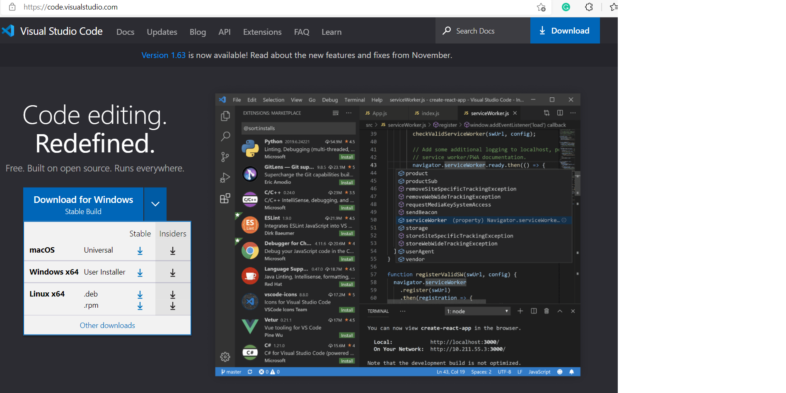
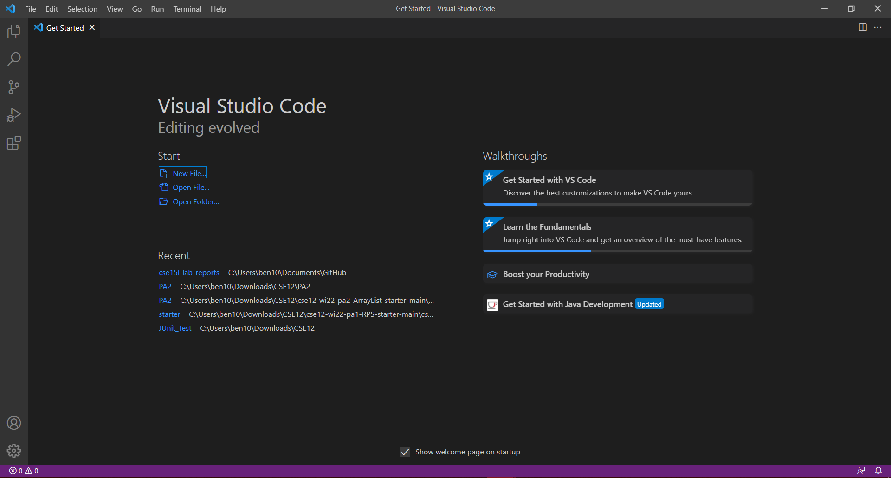
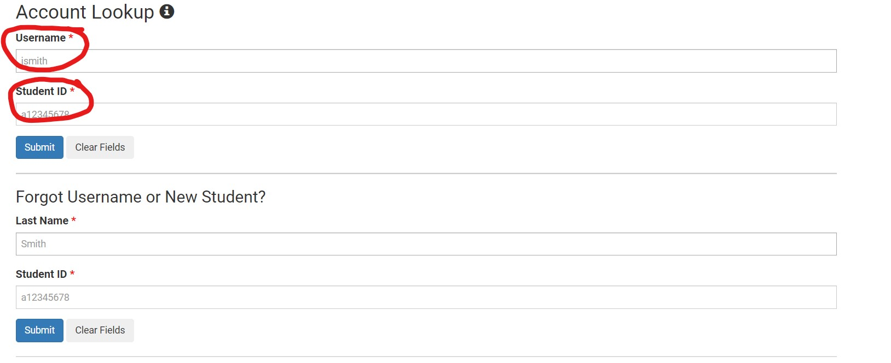
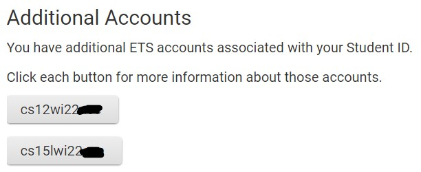
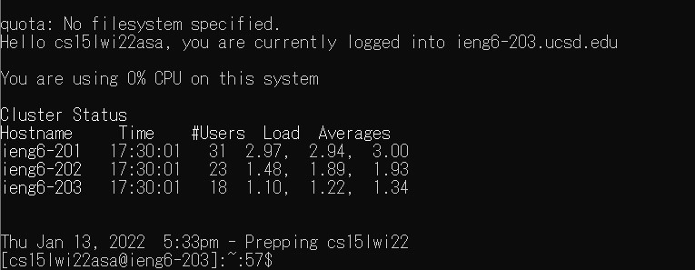
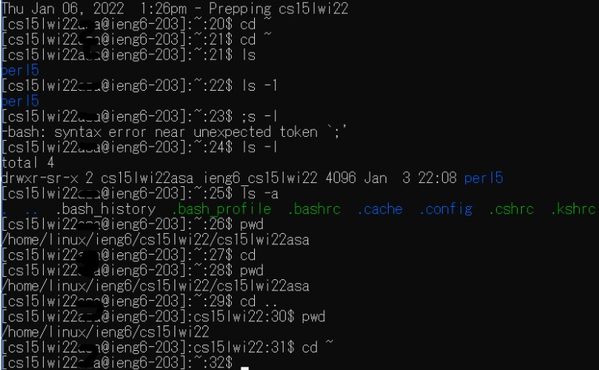
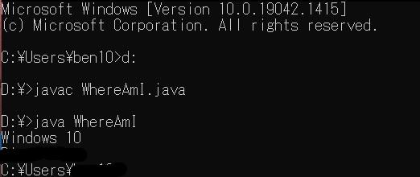
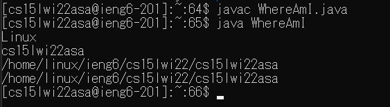
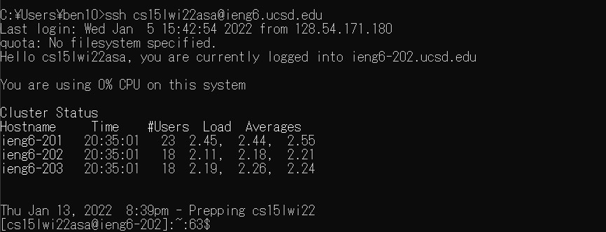
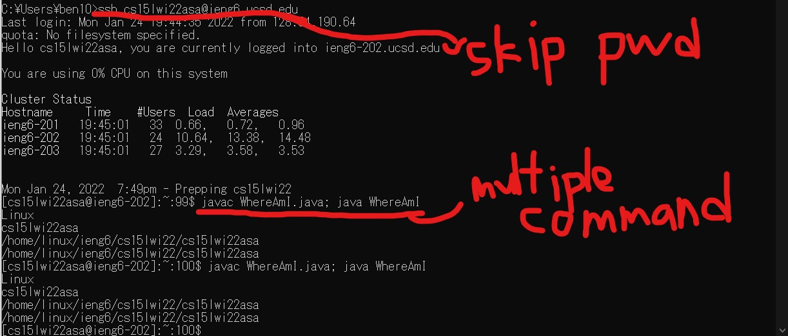

# Lab Report Week 2

## Setting up VS code

This is the step where we download editor for any coding, although we won't be going into too much detail for java, python, or specific coding as for now. This editor is capable for editing all those programming languages.

1. To set up VS code, simply goes to [VScode](https://code.visualstudio.com/) and download the downloader. Depend on your OS System, you might want to download the different version.

2. After you run through the process with downloader, you should be able to open VS code as the screenshot shown below.

3. Depend on your system setting or your OS system, the interface may be a bit different, but it should still contain most of the element shown in the screenshot.


## Remote Connecting

1. (Mac User can skip this step) download [OpenSSH](https://docs.microsoft.com/en-us/windows-server/administration/openssh/openssh_install_firstuse) as the tool for remote connect to another computer.

2. [Account look up](https://sdacs.ucsd.edu/~icc/index.php) use the link and enter your username and student id. your username is is the one in your email address and your student ID is the series of numbers that start with A or U.




3. Here you will find the account username that you are associate with, the one we are using is cs15lwi***(replace the stars with whatever your letters are) since we are in CSE 15L class.

4. Now you can try to connect with UCSD computer by using
`ssh cs15lwi22**@ieng6.ucsd.edu`
You may use terminal in VS code or cmd in windows. You will encounter something like 
```
The authenticity of host 'ieng6.ucsd.edu (128.54.70.227)' can't be established.
RSA key fingerprint is SHA256:ksruYwhnYH+sySHnHAtLUHngrPEyZTDl/1x99wUQcec.
Are you sure you want to continue connecting (yes/no/[fingerprint])? 
```
This is just saying that you are making a new connection, do you trust the source and want to continue. Since we know that we can trust the school's computer center (Please do), then just enter yes.

5. You will then be asked to enter your password, which won't be shown on screen, but just type it and press enter.
6. After you login, you will see 

Then you are officially in the school's computer.

## Try some commands
1. This section is to get used to navigating through computer with cmd or terminal. Some commands to use are 
`ls` & `ls (-a,-lat,directory)` `cd`, `cd ~`, `cp`, and `cat`


`ls` is file lisitng, it list out all the files in the current directory, adding some additional commands such `-a` can provide more details.

`cd` is the main method to move around different directory, such as copy a full folder address can move you to a differen directory.

`cp` is the command to copy an exisitng file to a new folder with different naming

`cat` is to concatenate files.

Finally, you can use `exit` to leave the server you are connecting to.

## Moving Files with `scp`

1. `scp` is the command for you to upload files into the server you are connecting to.
2. To test this out, create the file `WhereAmI.java` in your local machine.
3. You can then edit this file with the VSCode you just downloaded.
```
class WhereAmI {
  public static void main(String[] args) {
    System.out.println(System.getProperty("os.name"));
    System.out.println(System.getProperty("user.name"));
    System.out.println(System.getProperty("user.home"));
    System.out.println(System.getProperty("user.dir"));
  }
}
```
This code essentially tells you some information on your computer, such as OS system name, the name of the user, etc...

4. Open VSCode terminal, make sure you are in the directory of where your `WhereAmI.java` is localed. use the command `javac WhereAmI.java` to compile and `java WhereAmI` to execute the file.

This should be the expected output, which is some info of your local machine.

5. Then go back to terminal and use `scp WhereAmI.java cs15lwi22***@ieng6.ucsd.edu:~/`, login into school's server with ssh, then use `ls`.


You can see that the file is uploaded to the server.

6. Now do `javac WhereAmI.java` to compile and `java WhereAmI` to execute on the server. (Note: Now the file is runned on the server, not your machine)



You will notice that the output is different, since now the program is taking information from the computer from UCSD computer center instead of your machine.


## Setting an SSH Key
This part is for the purpose that we don't have to type our password everytime we log into the server using SSH

1. Type in `ssh-keygen` in your terminal or cmd, it will shows the message of `Enter file in which to save the key`, in which you will type in the address and file name of what you which your key to be save as. Eg:`D:\key`, this will save the key in the D drive with the file name called `key`.
2. As for Enter parenthesis, you can simply just type enter to skip over this step.
3. Once you completed it, you will see two file created, one called `key` and the other called `key.pub`, the one end with pub is the public key and one without is the private key.
4. (This step is for Windows user)  Windows users will need to do an extra step to [load your key into ssh agent](https://docs.microsoft.com/en-us/windows-server/administration/openssh/openssh_keymanagement#user-key-generation). Make sure to use **powershell** to execute ssh-agent, I've see a lot of people using **cmd** and failed.
5. Now we can log back on to the server and create a .ssh folder using command `mkdir .ssh`, then return your directory back to your local machine.
6. Now use `scp` command to upload the file ending with **.pub** up to the .ssh folder on the server.
7. Try to log back into the server, you will realize that you no longer need to type in the password.


## Optimizing Remote Running

There are some overall small tips that can help make the remote connecting and running commands a bit easiers. It is also recommand to research for some shortcuts.
1. Use up arrow keys to navigate through previous commands
2. Type multiple commands in a line separated by `;`
3. The most common Ctrl C + Ctrl V to copy and paste
4. Ctrl A to select text in current line
5. Use tab can cycle through all folders in current directory

- When you repeat the same command, you can use up arrow key to do so.
- You can also put multiple command together to execute multiple command at the same time

For the image above, the ssh with the key skip the password phase. Then using copy and paste shortcut keys, we compile and run the java file in one command. Then use the up arrow, we can repeat the compile and running of java.

KeyStroke count for running java file on the remote server. java = 4, copy/paste = 4, java = 4, paste = 2, semicolon = 1, delete extension name(.java) = 5, enter key = 1. The second time running only use up arrow key = 1. The total keystroke is 4+4+4+2+1+5+1+1 = 22 keystrokes to run the program twice.
