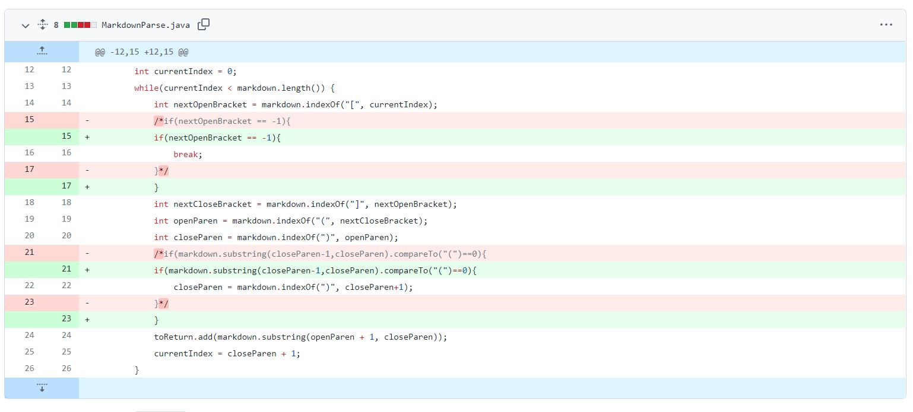
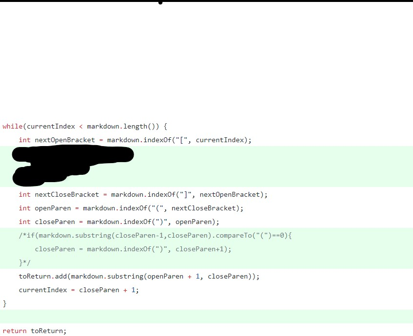
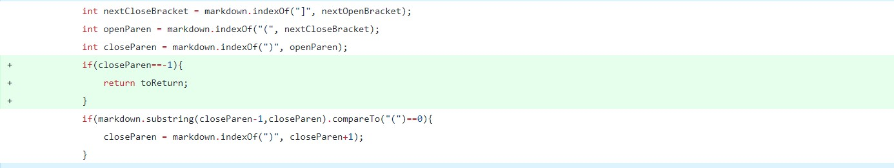
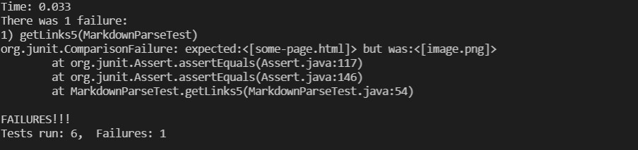
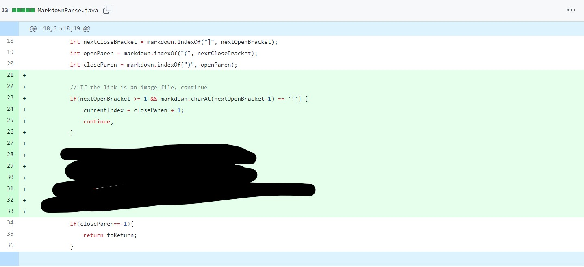
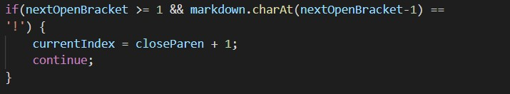

# Lab Report Week 4
In Week 3 and week 4 we use the MarkdownParse.java from the lecture and added our own test cases to The three cases are
1. A link: goog()le.com with correct format
2. [a-link] (www.google.com; missing a back parenthesis
3. Image file




> First issue

Link to first case: [Github](https://github.com/mlin1026/markdown-parse/blob/main/breaking-test.md)

For the first issue, we obtain an error message

```
Exception in thread "main" java.lang.OutOfMemoryError: Java heap space
        at java.base/java.util.Arrays.copyOfRange(Arrays.java:3822)
        at java.base/java.lang.StringLatin1.newString(StringLatin1.java:769)
        at java.base/java.lang.String.substring(String.java:2709)
        at MarkdownParse.getLinks(MarkdownParse.java:24)
        at MarkdownParse.main(MarkdownParse.java:33)
```
This is our symptom, having an OutOfMemeoryError with a while loop shows that there might be some infinite loop going on.


By having this information, we starting looking into the while loop and try to trace out the process as we run the code with this breaking test.

We noticed that after the code evaluate indexOf ")" and its not at the end of the string, it will loop back to the start of loop and search for "[", which is not found and return -1. Then it will just search CloseBracket, openParen, and closeParen from the start. This will result in an infinite loop.

Symptom: OutOfMemoryError

Bug: The loop and the behavior of indexOf to return -1 when element not found. We used that return to determine the next indexOf, which result in infinite loop.

> Second Issue

Link to second case: [Github](https://github.com/mlin1026/markdown-parse/blob/main/breaking-test_2.md)

The second issue we encounter this issue:

```
Exception in thread "main" java.lang.StringIndexOutOfBoundsException: begin -2, end -1, length 24
        at java.base/java.lang.String.checkBoundsBeginEnd(String.java:4601)
        at java.base/java.lang.String.substring(String.java:2704)
        at MarkdownParse.getLinks(MarkdownParse.java:21)
        at MarkdownParse.main(MarkdownParse.java:36)
```

This time we have an index out of bound, with the index of -2. From the previous debugging process, we know that there will be possibility where indexOf return -1. By looking at the code we modified, we noticed that there is a part of the method where there is closeParen-1, while we know that there isn't any close parenthesis in this test file. Thus we know that we need to try to find a way to terminate the program before we reach that statement. So our fix this time will be:



We decide to just return the string if close parenthesis isn't found in the whole string, since we know that without it, it isn't a link.

Bug: markdown.substring(closeParen-1,closeParen), if closeParen is -1, it will hav an index of -2

Symptom: Index out of bound error

> Third issue

Link to third case: [Github](https://github.com/mlin1026/markdown-parse/blob/main/breaking-test4.md)

The third case is an file with images and links, which the output pull both normal link and image link into output.

The symptom is: 


We realize that the code didn't take into "!" into account when grabbing links, which result in code including the image link into the output.


Commit:

We fix it by making sure that there isn't any ! before openBracket, if there is, we skip this part of the md file.




The symptom is that the output is grabbing image into link set

The bug is that the code didn't take into encounter of ! before the image link, which result in code grabbing image link into link also.

