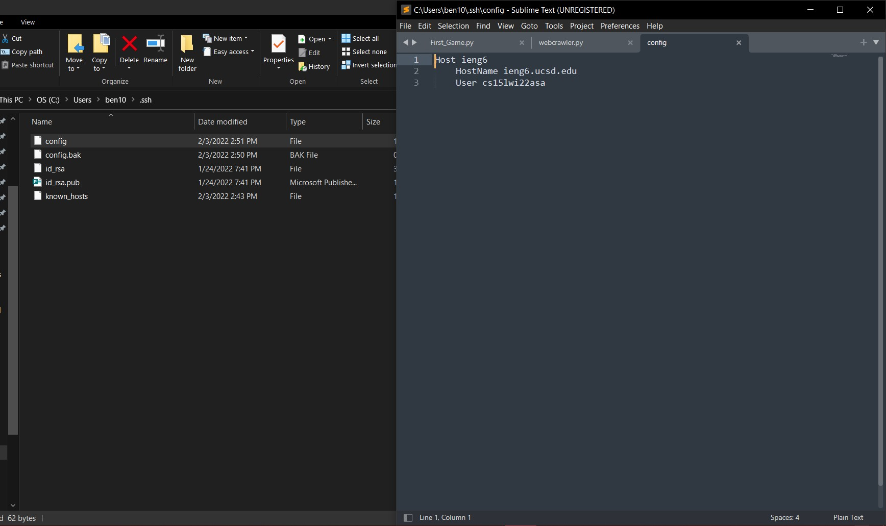
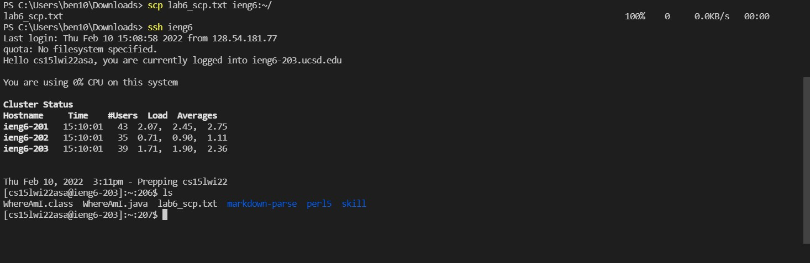

[back to index](index.html)

# Lab Report Week 2

## Streamlining ssh Configuration

When using ssh, we usually use 
`ssh cse15lwi22***@ieng6.ucsd.edu`
, which required a lot of typing and remembering your username. The ultimate goal for us to configure ssh this time is so what we can login into the server with just `ssh ieng6`. So that's get started!

1. Locate your .ssh folder that contain your ssh keys.
. There you will create an `config` file. (litearlly just name it config, no extension what so ever).

2. Now open the `config` file with text editor, then input these commands

```
Host ieng6
    HostName ieng6.ucsd.edu
    User cs15lwi22zzz (use your username)
```


Then save the file.

3. now try to connect to the server using just `ssh ieng6`, you should be able to log in right away.


Congrate, you just make your remote connection a lot faster than having to type in full username.

You can also scp file in the remote server extremely fast now with ssh configurated.



By just simply using `scp (filename) ieng6:~/`, you can easily upload the file into the remote server.


