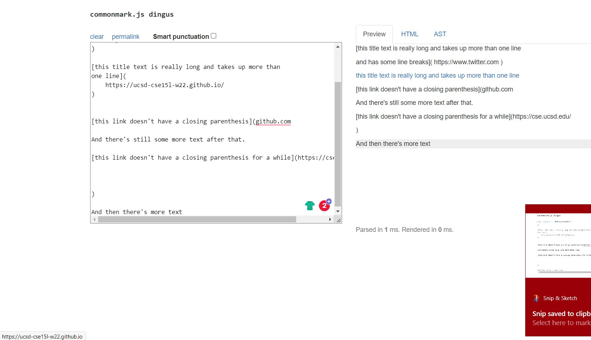
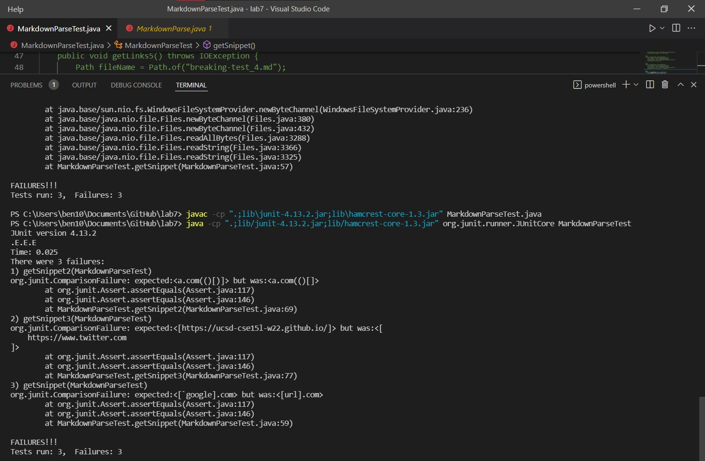

[back to index](index.html)

# Lab Report Week 8

## Snippet 1 Expected output

Using CommonMark demo site, we obtained:


our link array should only have three element

`'google.com`

`google.com`

`ucsd.edu`

## Snippet 2 Expected output

Using CommonMark demo site, we obtained:


our link array should have three elements:

`a.com` 

`a.com(())`

`example.com`

## Snippet 3 Expected output

Using CommonMark demo site, we obtained:



our link array should have one element

`https://ucsd-cse15l-w22.github.io/` 


## Testing methods (6 total, 3 unique test)

Knowing the expected output, we are able to use assertEqual to test whether the method output is the same as expected


What we did here is just assertEqual each elements of the link array to what we expected from the result of the demo website.

This will be the same for ther code we reviewed.

## My MarkdownParse


In my code, all three tests failed

For first snippet, it still read the link that contain \`[\`] as a link, which is not what we wanted from the expected output.

For second snippet, the other two links work expect

`a.com(())`

It only read the first close parenthesis

For the third snippet, the code still read the link with next line of open brackets.

```
[this title text is really long and takes up more than 
one line

and has some line breaks](
    https://www.twitter.com
)


```
While md only recognize link if [] are in the same line.

## Reviewed MarkdownParse



Out of surprise, the errors are exactly the same wiht my own code. There isn't much to say with this, all the outputs are exactly the same with my code, thus the errors are the same also

## Changes

1. Do you think there is a small (<10 lines) code change that will make your program work for snippet 1 and all related cases that use inline code with backticks? If yes, describe the code change. If not, describe why it would be a more involved change.

I think it is possible to fix this bug within ten line. We can check if there is ` before the open bracket, then check if there is anther one inside open and close bracket. We can also check if there is one inside open/close bracket, and one after close bracket. If any of those applies, we return empty and move  to next link.

2. Do you think there is a small (<10 lines) code change that will make your program work for snippet 2 and all related cases that nest parentheses, brackets, and escaped brackets? If yes, describe the code change. If not, describe why it would be a more involved change.

I think this one is also pretty easy to fix. Knowing that we want to get all close parenthesis, have a while loop that continuing to find the nexxt ) if they are all together like this ")))" till we find the last one, then return that next.

3. Do you think there is a small (<10 lines) code change that will make your program work for snippet 3 and all related cases that have newlines in brackets and parentheses? If yes, describe the code change. If not, describe why it would be a more involved change.

I think this one can also be fix. if we find any [] with a new line, we instantly move on to the next link. If we find any () with more than one new lines, we isntantly move on to the next link. I think this can still be done within 10 lines.


