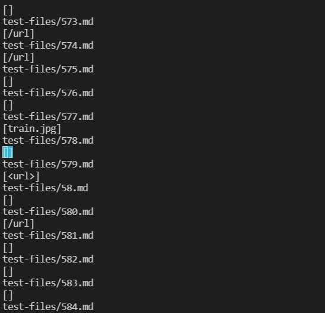
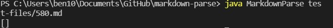
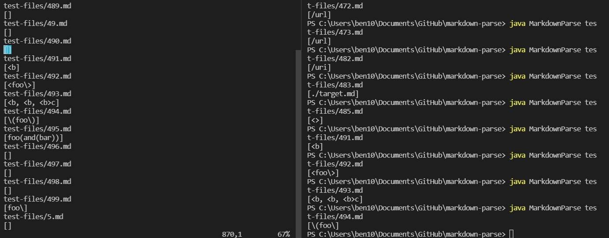
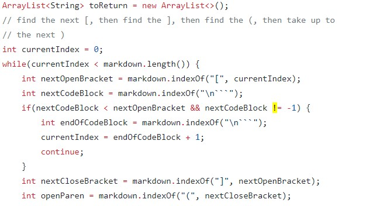
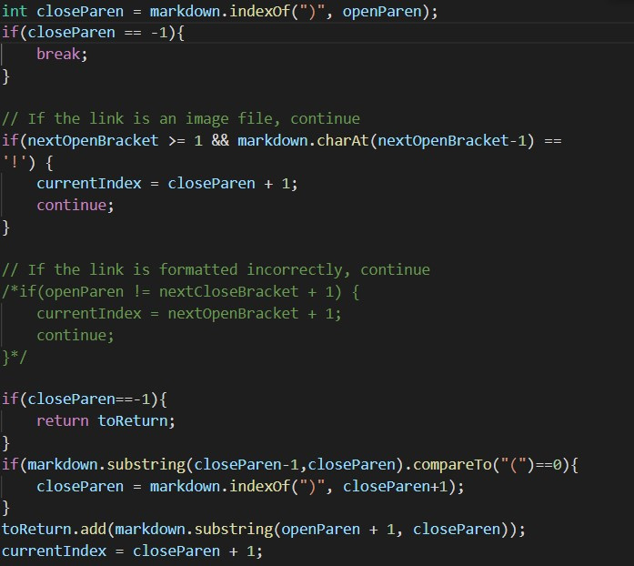

[back to index](index.html)

# Lab Report Week 10

## Two file with different output

Due to the unknown reason that cause the infinite loop in my code, I decide to search through the test-files manually. Luckily, I still found some file with different output. The first one is 580.md

The output from Joe's code is 
 for 580.md (/url)

When I run my own code, I obtain
 nothing for 580.md

The second one is 494, which from Joe's code is 

 

From Joe's code, I obtain `\(foo\)`
From my code, I have `\(foo\`

## What's wrong?

Let's look at 580.md first, it contain
``, which is an image format, thus there is no link, and my implementation is correct

By looking at Joe's code, we notice how the code didn't consider any image format, which is ``, contained a ! at the beginning, while the loop in getLinks didn't consider that ! before open bracket. Thus if we put a if statement that i tehre is a ! before open bracket, we can terminate continue the loop move on to the next open bracket.

For 494, it contains
`[link](\(foo\))`, which is another image format, thus there is no link, and my implementation is still correct. By plugging it into commonMark, the link is `(foo)`, which means that Jose's code is correct on this one.

In our code, we didn't return the `)` as intended by commonMark. By looking at our code

we notice we didn't take into consider of `\)`, which is a character instead of a formatting symbol. Thus after we find the closeParen, we can check if there is a `\` right before it, if there is, we find the next closeParen. THis can be done right after the `int closeParen = markdown.indexOf` and with a while loop saying that if there is a `\` before the closeParen, find the next closeParen.